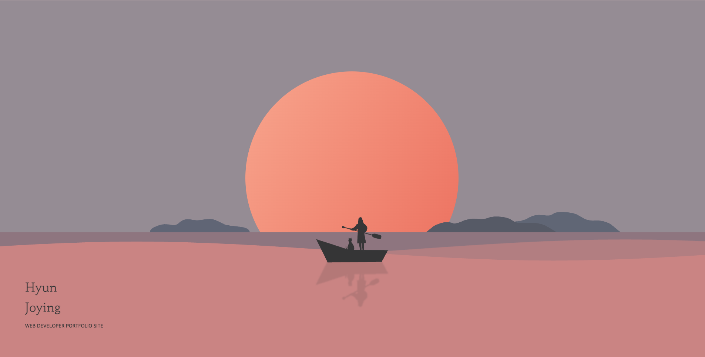

# 🌊 Deep Dive : My Developer Journey

> **"Slow, but Deep Dive."** 
> 노을에서 심해로, 그리고 다시 별이 빛나는 밤으로. 
> 개발의 세계에 입문하던 저의 설렘과 몰입을 담은 **인터랙티브 스토리텔링 웹사이트**입니다.

 

### 바로가기 (Live Demo)
https://guswjd8694.github.io/portfolio/

 

### 프로젝트 정보 (Project Info)
**제작 기간:** 2021년  
**참여 인원:** 개인 프로젝트 (기획, 디자인, 개발 100%)

 

### 컨셉 (Story & Concept)
"느리지만 깊게 파고드는" 저의 개발 정체성을 시각화한 프로젝트입니다.

**노을 지는 수면 위, 작은 배**는 개발이라는 낯선 세계에 처음 뛰어든 순간의 설렘이고 
**깊어지는 바다 속**은 하나씩 이해하며 내려간 깊이이며 
**다시 수면 위, 밤하늘과 달**은 성장 후 마주한 평온함과 단단함입니다.

스크롤을 내릴수록 깊어지는 바다처럼, 저의 개발 여정을 Parallax Scrolling으로 담았습니다.

 

### 주요 기능 (Key Features)
**Parallax Scrolling** - 스크롤 위치에 따라 배경과 오브젝트가 각기 다른 속도로 움직이는 입체감 구현 
**Storytelling UI** - 사용자의 스크롤 흐름에 따라 자연스럽게 이어지는 서사 구조 기획 
**Pure JavaScript** - 라이브러리 없이 순수 Vanilla JS로 DOM 조작 및 이벤트 처리 로직 구현

 

### 기술 스택 (Tech Stack)

    
    
    
    

